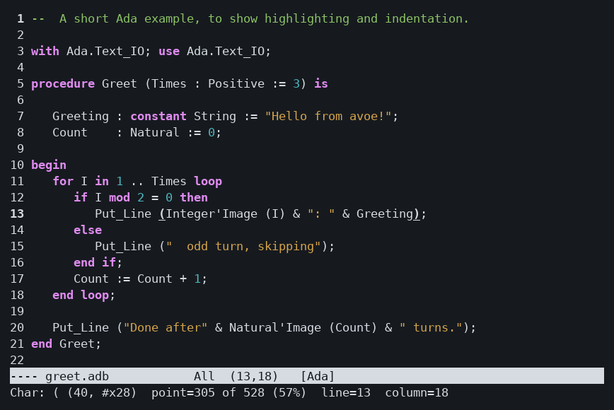
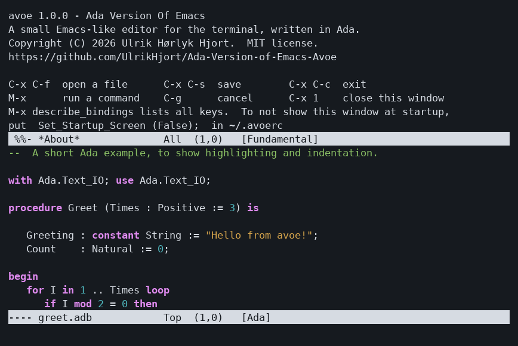

# Ada Version of Emacs - Avoe [ay-VOH]

A small Emacs-like editor for the Linux terminal, written in Ada 2012.
In the spirit of Jove: familiar Emacs keys, small and fast, no ncurses.



Version 1.0.0. See [CHANGELOG.md](CHANGELOG.md) for what changed between versions.

At startup the upper window shows `*About*`: the version, the author and a few
keys. `C-x 1` closes it, and `Set_Startup_Screen (False);` in your init file
(or `--no-splash`) turns it off.



Both pictures are made with `make screenshots`, which runs avoe in a
pseudo-terminal and draws what it prints (`tools/screenshot.py`).

## Build

Requires GNAT and gprbuild.

    make            # or: gprbuild -P avoe.gpr
    make format     # reformat the C sources with clang-format (.clang-format)
    ./bin/avoe [file ...]

Options:

    -q, --no-init          do not load your scripts and init file
    --batch SCRIPT [file]  run an Avoe script without a terminal
    --no-splash            do not show the startup screen
    --paths                show where scripts and configuration are loaded from

## Install

With [Alire](https://alire.ada.dev):

    alr build        # build in the crate directory
    alr install      # install into Alire's prefix (~/.alire by default)

`alr install` installs the program together with its bundled scripts,
documentation and man page (listed in the `Install` package of `avoe.gpr`),
so avoe finds its modes just as after `make install`. It installs no site
configuration.

With make:

    make
    sudo make install                    # under /usr/local
    make install PREFIX=~/.local         # just for you, no root needed
    make install DESTDIR=pkg PREFIX=/usr # stage files for a distribution package
    sudo make uninstall                  # same PREFIX as for install

Installed files follow the usual Linux layout:

| Path | Contents |
|------|----------|
| `PREFIX/bin/avoe` | the program |
| `PREFIX/share/avoe/*.avoe` | bundled scripts and modes (replaced on upgrade, don't edit) |
| `PREFIX/etc/avoe/site.avoe` (`/etc/avoe` when `PREFIX=/usr`) | site-wide configuration, never overwritten |
| `PREFIX/share/doc/avoe/` | documentation and an example init file |
| `PREFIX/share/man/man1/avoe.1` | man page |

Your own files follow the XDG base directory spec:

| Path | Contents |
|------|----------|
| `~/.config/avoe/init.avoe` (or `~/.avoerc`) | your init file |
| `~/.config/avoe/scripts/*.avoe` | your own scripts and modes, loaded automatically |

At startup avoe loads, in order:
1. The bundled scripts.
2. The site config.
3. Your scripts.
4. Your init file.

Later files can override earlier ones. `-q` skips 3 and 4. avoe finds its
data relative to its own executable, so the build tree and any `PREFIX`
work without configuration. `$AVOE_DATA_DIR` overrides this, and
`avoe --paths` shows exactly what is used.

## Keeping your files safe

- **Safe saving:** avoe writes a temporary file next to the original and
  renames it into place. A crash or a full disk never leaves a half-written
  file. Permissions are kept, and saving through a symbolic link updates the
  file it points to.
- **Backups:** the first save of a file in each session keeps the previous
  version as `file~`. Turn this off with `Set_Backups (False);`.
- **Exiting:** C-x C-c offers to save each modified file. A buffer without
  a file, such as `*scratch*`, is not asked about. With
  `Set_Confirm_Exit (True);` in your init file, C-x C-c also asks "Some
  buffers haven't been saved; leave anyway? (yes or no)" while any buffer
  has unsaved changes. Type `yes` or `no`; C-g cancels.
- **Auto-save:** unsaved changes are written to
  `~/.local/state/avoe/auto-save/` every 300 keystrokes and after 30
  seconds without input. Change this with `Set_Auto_Save (Keys => 100,
  Idle_Seconds => 10);`. After a crash, opening the file offers to recover
  the changes, and `M-x recover_file` does it by hand. Auto-save files are
  removed when you save, and when you exit normally.
- **Files changed by other programs:** a buffer without unsaved changes is
  reloaded automatically. Otherwise avoe warns you, and saving asks before
  overwriting. `M-x revert_buffer` reloads the file.
- **Undo history:** limited to the most recent 20,000 changes (16 MB of
  deleted text), so long sessions don't grow without bound.
- **Internal errors:** if a command fails because of a bug in avoe, the
  editor keeps running, and the details, including a traceback, are appended
  to `~/.local/state/avoe/internal-errors.log`. Please include them when you
  report the bug.

## Modes, highlighting and compiling

Each buffer has a major mode, chosen from the file name and shown in the
mode line:

| Mode        | Files                     | Gives                                  |
|-------------|---------------------------|----------------------------------------|
| Ada         | `.adb .ads .ada .gpr`     | highlighting, GNAT-style indentation   |
| Avoe-Script | `.avoe`, `.avoerc`        | same as Ada                            |
| C           | `.c .h`                   | highlighting, K&R indentation (script) |
| Python      | `.py .pyw`                | highlighting, block indentation, TAB cycling (script) |
| Shell       | `.sh .bash .zsh .bashrc .profile ...` | highlighting, if/for/case indentation (script) |
| Compilation | `*compilation*`           | coloured errors/warnings, jump to them |
| Fundamental | everything else           | plain text                             |

The C, Python and shell modes are written entirely in Avoe script: see
[share/avoe/](share/avoe/). Shared text helpers are in `00-helpers.avoe`.
In each mode file, the `Define_Mode` call gives the syntax table, which
drives the native highlighter. The indentation commands are ordinary
script procedures bound to TAB and RET.

In Python mode, TAB first goes to the suggested indentation. Pressing it
again steps one level out, since Python indentation is ambiguous.

Every `*.avoe` file in `share/avoe` is loaded at startup. You can add your
own modes in `~/.config/avoe/scripts/` without touching the installation.
`M-x set_major_mode` switches a buffer's mode.

In Ada and Avoe-Script mode, TAB re-indents the line, RET re-indents it and
indents the next one, and `C-c C-c` compiles.

`M-x compile` runs a build command in the background (default: `make -k`, or
`gprbuild -P x.gpr` if there is a project file) in the directory of the
current file. You can keep editing while it runs; output appears in
`*compilation*`.

- `` C-x ` `` or `M-g n` jumps to the next `file:line:col:` error.
- `M-g p` jumps to the previous error.
- In `*compilation*`, RET visits the error on that line, `g` recompiles and
  `C-c C-k` kills the build.

In Ada, C, Python and shell modes:
- **`C-c C-o` (find_other_file):** switches between body and spec (`.adb`/`.ads`,
  `.c`/`.h`, `.cpp`/`.hpp`).
- **`C-c C-f` (format_buffer):** runs the mode's formatter on the buffer. The
  defaults are `gnatpp` (Ada), `clang-format` (C), `black` (Python) and
  `shfmt` (shell), and `Set_Formatter` changes them. The text is only replaced
  if the formatter succeeds; otherwise its error output is shown.

Scripts can customise all of this:

```ada
Set_Face ("keyword", "1;34");          --  ANSI colour codes
Set_Indent_Width (3);
Bind_Mode_Key ("ada", "C-c b", "compile");

procedure Ada_Mode_Hook is             --  runs when a buffer enters Ada mode
   pragma Command;
begin
   Message ("Ada mode");
end Ada_Mode_Hook;
```

## Scripting

Avoe is extended with **Avoe script**, a lightweight Ada-flavoured language.
See [docs/avoe-script.md](docs/avoe-script.md) and the example init file
[examples/avoerc.avoe](examples/avoerc.avoe) (copy it to `~/.config/avoe/init.avoe`).

```ada
procedure Duplicate_Line is
   pragma Command;                      --  becomes an editor command
   Text : constant String := Current_Line;
begin
   End_Of_Line;
   Insert (LF & Text);
end Duplicate_Line;

Bind_Key ("C-c d", "duplicate_line");
```

`M-:` evaluates an expression (`2 ** 10`) or statements (`Kill_Line (3);`).
`M-x load_file`, `eval_buffer` and `eval_region` run scripts. C-g stops a
runaway script.

## Concepts

Every key runs a **named command** (`find_file`, `kill_line`, ...). Keys are
bound to names in keymaps, so any command can also be run with `M-x`, and
scripts can bind keys to their own commands the same way.
`M-x` accepts both `find_file` and `find-file`.

`C-u` gives a prefix argument: `C-u 8 C-f` moves 8 characters, `C-u C-u x`
inserts 16 x's, `C-u 42 M-g g` goes to line 42.

## Keys

### Motion
| Key                    | Command               |
|------------------------|-----------------------|
| C-f / C-b, arrows      | forward/backward_char |
| C-n / C-p              | next/previous_line    |
| M-f / M-b, C-arrows    | forward/backward_word |
| C-a / C-e, Home / End  | beginning/end_of_line |
| M-< / M->              | beginning/end_of_buffer |
| C-v / M-v, PgDn / PgUp | scroll_up / scroll_down |
| C-l                    | recenter              |
| M-g g                  | goto_line             |

### Editing
| Key            | Command                       |
|----------------|-------------------------------|
| C-d, Delete    | delete_char                   |
| DEL, C-h       | delete_backward_char          |
| C-j            | newline_and_indent            |
| C-o            | open_line                     |
| C-q            | quoted_insert                 |
| C-t            | transpose_chars               |
| M-u / M-l / M-c| upcase/downcase/capitalize_word |
| C-_, C-x u     | undo (repeat to go further back; any other command in between lets you undo the undo) |
| M-;            | comment_dwim: comment or uncomment the line, or the lines of the region right after C-SPC |
| M-q            | fill_paragraph: rewrap a paragraph or comment to the fill column (70; C-x f sets it) |
| C-M-f / C-M-b  | forward_sexp / backward_sexp: jump over a bracketed group (matching brackets are underlined) |
| M-m            | back_to_indentation           |
| M-\ / M-SPC    | delete_horizontal_space / just_one_space |
| M-^            | delete_indentation: join the line to the previous one |
| M-t / C-x C-t  | transpose_words / transpose_lines |
| C-x C-u / C-x C-l | upcase_region / downcase_region |
| M-{ / M-}      | backward_paragraph / forward_paragraph (paragraphs end at blank lines) |
| M-/            | dabbrev_expand: complete the word before point from words in your buffers, nearest first; repeat for the next one |

### Mark, kill and yank
| Key       | Command                  |
|-----------|--------------------------|
| C-SPC     | set_mark                 |
| C-x C-x   | exchange_point_and_mark  |
| C-x h     | mark_whole_buffer        |
| C-k       | kill_line                |
| C-w / M-w | kill_region / copy_region |
| M-d / M-DEL | kill_word / backward_kill_word |
| M-z       | zap_to_char: kill up to and including the next occurrence of a character |
| C-y       | yank                     |
| M-y       | yank_pop (after C-y: cycle through older kills) |

### Search
| Key   | Command |
|-------|---------|
| C-s / C-r | isearch_forward / isearch_backward. Type to extend, C-s/C-r for next/previous, DEL to back up, RET to stop, C-g to abort. Lower-case search ignores case. |
| M-%   | query_replace. y/SPC replace, n/DEL skip, ! replace all, . replace and stop, q/RET stop. |
| C-M-s / C-M-r | isearch_forward_regexp / isearch_backward_regexp, same keys as C-s |
|       | replace_regexp, query_replace_regexp (via M-x): the replacement may use `\1`..`\9` and `\&` |

Regular expressions use Perl-like syntax (`[0-9]+`, `(a|b)`, `\s`, `\w`,
`^`, `$`, `(...)` groups). They match within a line. A pattern without
upper-case letters ignores case.

### Files, buffers, windows
| Key       | Command                  |
|-----------|--------------------------|
| C-x C-f   | find_file                |
| C-x C-s   | save_buffer              |
| C-x C-w   | write_file               |
| C-x s     | save_some_buffers        |
| C-x i     | insert_file              |
| C-x C-q   | toggle_read_only         |
|           | revert_buffer, recover_file (via M-x) |
| C-x b     | switch_to_buffer         |
| C-x C-b   | list_buffers             |
| C-x k     | kill_buffer              |
| C-x 2     | split_window             |
| C-x o     | other_window             |
| C-x 0     | delete_window            |
| C-x 1     | delete_other_windows     |
| C-x C-c   | save_buffers_kill_editor |

### Other
| Key     | Command                  |
|---------|--------------------------|
| M-x     | execute_extended_command (TAB completes) |
| C-u     | universal_argument       |
| C-g     | keyboard_quit            |
| M-:     | eval_expression          |
| M-!     | shell_command: one line of output is shown as a message, more in `*Shell Command Output*`; with C-u the output is inserted |
| M-\|    | shell_command_on_region: the region is the command's input; with C-u the output replaces it |
|         | grep (via M-x): results go to `*compilation*`, so `` C-x ` `` visits them |
|         | load_file, eval_buffer, eval_region (via M-x) |
| C-x ( / C-x ) | start_kbd_macro / end_kbd_macro: record a keyboard macro |
| C-x e   | call_last_kbd_macro: run it (C-u N: N times); press e to run it again |
| C-x =   | what_cursor_position     |
| M-=     | count_words_region: lines, words and characters in the region (or the buffer) |
|         | display_line_numbers_mode (this buffer), global_display_line_numbers_mode (all buffers), via M-x: line numbers in the left margin; `Set_Line_Numbers (True);` in your init file turns them on everywhere. The mode line always shows `(line,column)`, columns counted from 0 |
| C-z     | suspend_editor           |
|         | describe_key, describe_bindings, describe_function, apropos_command (via M-x) |
|         | about_avoe (via M-x): the version, author and key hints shown in the startup screen |

In the minibuffer (the prompt line):
- **Moving:** C-a/C-e, C-b/C-f or the arrow keys, and M-b/M-f by word.
- **Deleting:** DEL and C-d delete characters, M-DEL deletes a word, C-k
  kills to the end, and C-u clears the input.
- **Other keys:** C-y yanks, and TAB completes files, buffers and commands.
- **History:** M-p/M-n or Up/Down go back and forth through earlier input
  to the same prompt.
- RET accepts, and C-g aborts.

## Limits

- **File size:** about 1 GiB per buffer. A larger file is not opened (and
  is not changed); the message says it could not be read. Up to that size
  loading is quick: a 400 MB file loads, edits and saves in a few seconds,
  using about 1.4 times the file size in memory.
- **Undo:** the most recent 20,000 changes, or 16 MB of deleted text.
- **Highlighting:** lines longer than 4,096 bytes are shown without colours.
- **Regexp search:** a match cannot span lines.

## Source layout

| File                 | Purpose                                              |
|----------------------|------------------------------------------------------|
| `avoe.adb`            | Main program                                         |
| `terminal.*`         | Raw mode, window size, byte I/O (with `term_c.c`)    |
| `keys.*`             | Decoding bytes into keys (UTF-8, escape sequences)   |
| `gap_buffers.*`      | Gap buffer storage                                   |
| `buffers.*`          | Point, mark, markers, undo, search, lines, files     |
| `buffer_list.*`      | All buffers, most recently used first                |
| `windows.*`          | Window layout, per-window point and scroll position  |
| `display.*`          | Redisplay with row diffing, mode lines, echo area    |
| `minibuffer.*`       | Messages, prompts, questions, completion             |
| `commands.*`         | Command registry and command context (prefix arg...) |
| `keymaps.*`          | Key sequence parsing, keymaps, bindings              |
| `kill_ring.*`        | The kill ring                                        |
| `file_names.*`       | ~ expansion and file name completion                 |
| `edit_commands.*`    | Motion, editing, kill/yank, undo, case commands      |
| `file_commands.*`    | File, buffer and window commands                     |
| `search_commands.*`  | Incremental search, query replace                    |
| `editor.*`           | Command loop, key dispatch, M-x, default bindings    |
| `scripts-lexer.*`    | Avoe script tokens                                    |
| `scripts-parser.*`   | Avoe script recursive descent parser                  |
| `scripts-ast.*`      | Syntax tree                                          |
| `scripts-values.*`   | Run-time values and types                            |
| `scripts-interpreter.*` | Tree-walking interpreter                          |
| `scripts-builtins.*` | The editor API for scripts                           |
| `script_commands.*`  | eval/load commands, init file, batch mode            |
| `utils.*`            | String helpers                                       |
| `syntax.*`           | Syntax highlighting, faces, error location parsing   |
| `ada_indent.*`       | Ada indentation                                      |
| `modes.*`            | Major modes, mode hooks, mode keymaps                |
| `processes.*`        | Background processes (with `term_c.c`)               |
| `compile_commands.*` | compile, next_error, *compilation* buffer            |
| `mode_defs.*`        | The mode table (built-in and script-defined modes)   |
| `share/avoe/*.avoe`    | Bundled modes written in Avoe script (C mode)         |

## Roadmap

1. **Done:** terminal layer, gap buffer, basic editing, files.
2. **Done:** keymaps and named commands, M-x, prefix argument, undo, kill
   ring, incremental search, query replace, multiple buffers and windows,
   completion.
3. **Done:** Avoe script with init file, script commands, M-: and batch
   mode.
4. **Done:** major modes, syntax highlighting, Ada indentation, compile
   buffer with error navigation.

## Tests

    make test

The tests drive the real binary in a pseudo-terminal and in batch mode
(`tests/*.py`, Python 3).

## License

MIT, see [LICENSE](LICENSE).
